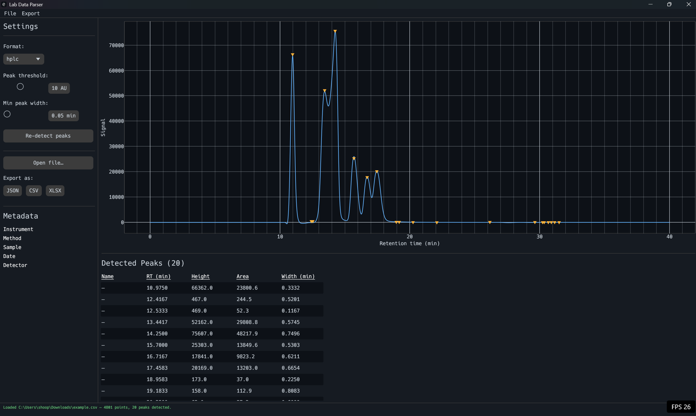

# Lab Data Parser

Lab Data Parser is a fast, native toolkit for parsing, analyzing, and visualizing laboratory chromatography (HPLC) and mass spectrometry (mzML) data. Written entirely in Rust, it provides a unified data model with both a CLI and an interactive GUI.



## Features

- **Multi-format parsing:** Supports HPLC CSV/TXT and mzML/mzXML formats.
- **Peak Detection:** Tunable peak detection with adjustable threshold and width parameters.
- **Interactive GUI:** An `egui`-based standalone app allowing live visualization, peak tuning, and manual peak labeling.
- **Exporting:** Export processed chromatograms to CSV, JSON, XLSX, or render a static PNG chart.
- **Cross-Platform:** Compiles to a single native binary on Windows, macOS, and Linux with no external runtime dependencies.

## Installation

Ensure you have [Rust](https://www.rust-lang.org/) installed.

### Building the GUI (Release)
To build the standalone GUI application with maximum optimizations:

```bash
cargo build --release -p lab-data-parser-gui
```
The compiled executable will be located in `target/release/lab-data-parser-gui.exe` (on Windows). You can copy this file and share it with colleagues directly.

### Building the CLI
```bash
cargo build --release -p lab-data-parser-cli
```

## Usage (GUI)

1. Run the application: `cargo run --release -p lab-data-parser-gui`
2. Click **Open file...** to load your laboratory data.
3. Use the **Peak threshold** and **Min peak width** sliders to fine-tune the automated peak detection.
4. Interact with the plot to zoom in on peaks and view their retention times.
5. In the table below the plot, click on a peak's name to manually label it.
6. Use the **Export as** buttons (or the File menu) to save your results to CSV, JSON, XLSX, or PNG.

## License

Dual-licensed under [MIT](LICENSE-MIT) or [Apache-2.0](LICENSE-APACHE), at your option.